Doctor Material App
===============================

This sample demonstrates basic usage of Doctor App

Introduction
------------

This is react native expo project of latest version we use expo native web for use in local
`Atom project`
You can see our live website [Atom Project][1].

[1]: https://lazygetter.store/lazygetter/Ecommerce/public/shop

Pre-requisites
--------------
- expo 41.0.1
- "@react-native-community/masked-view 0.1.10,
- react-navigation/bottom-tabs 5.11.10
- react-navigation/drawer ^5.12.5",
- react-navigation/material-top-tabs ^5.3.15,
- react-navigation/native ^5.9.4,
- react-navigation/stack ^5.14.4,
- axios ^0.21.1,

Screenshots
-------------

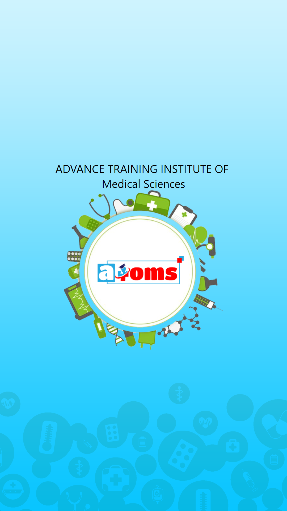
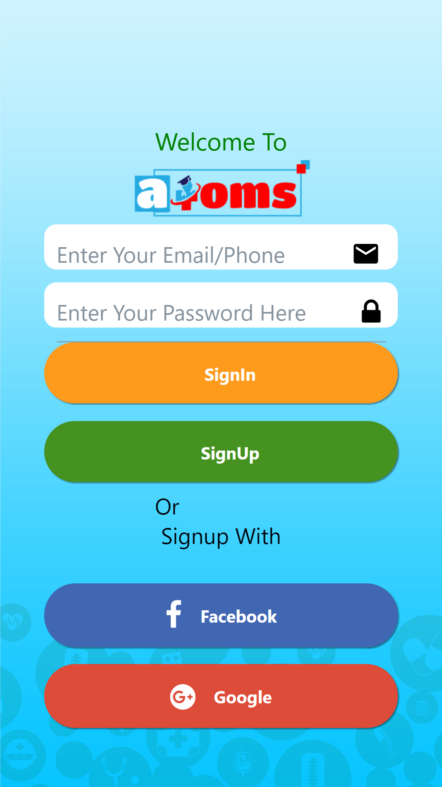
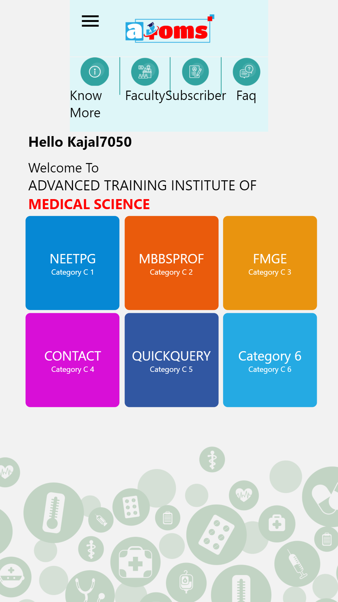
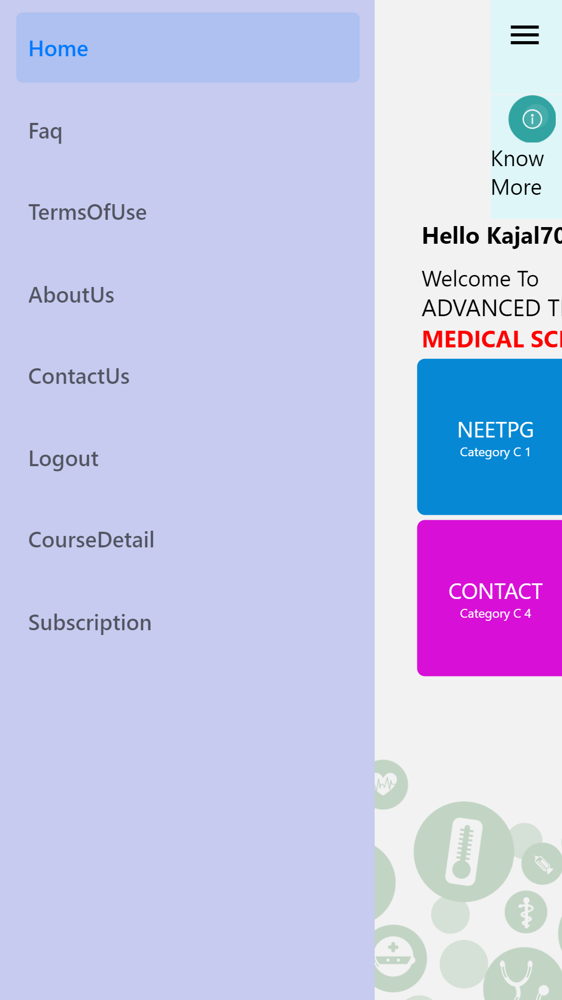
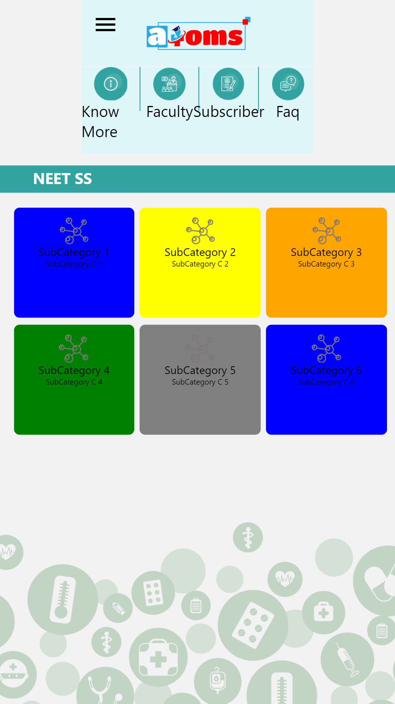
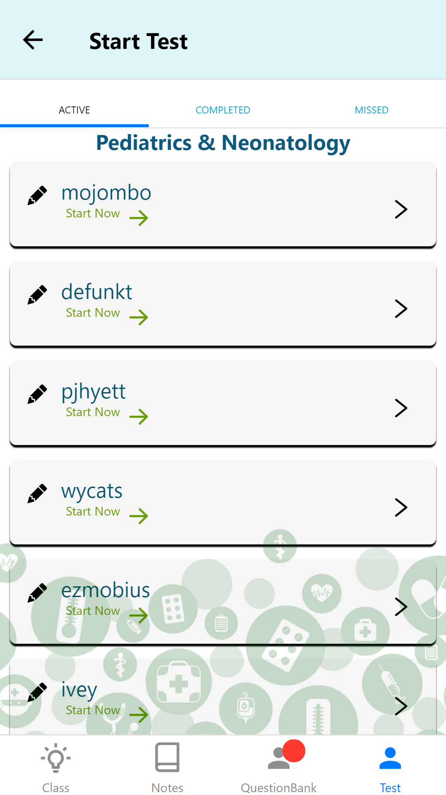
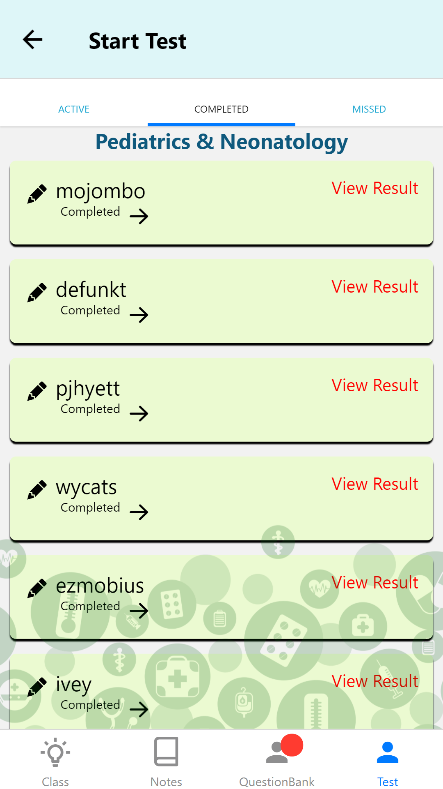
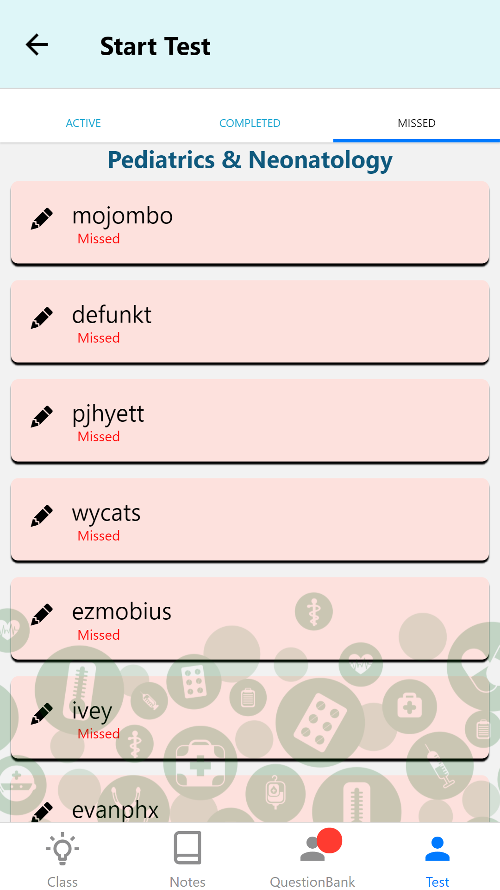
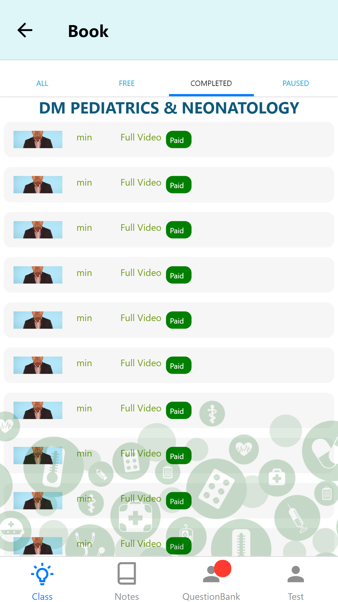
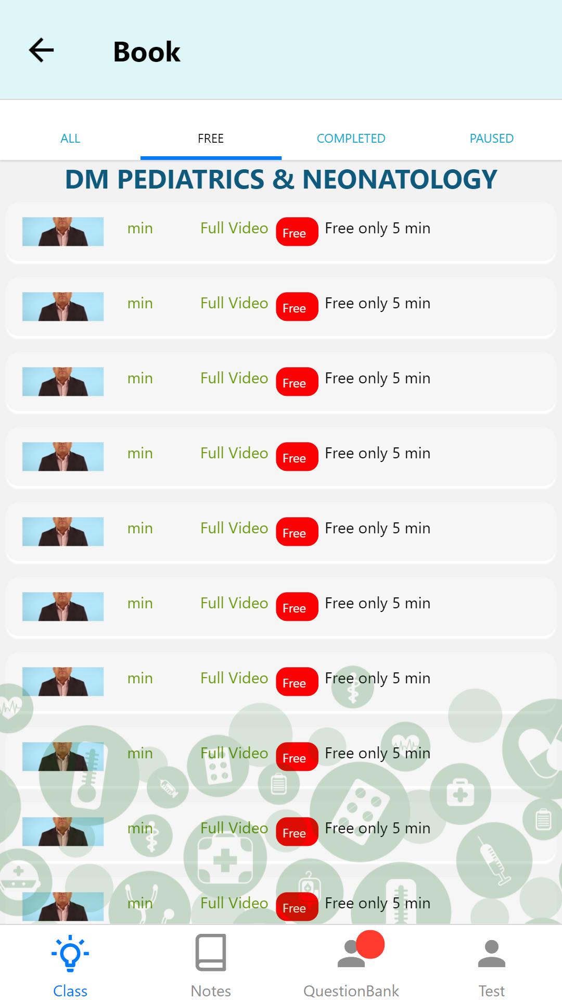
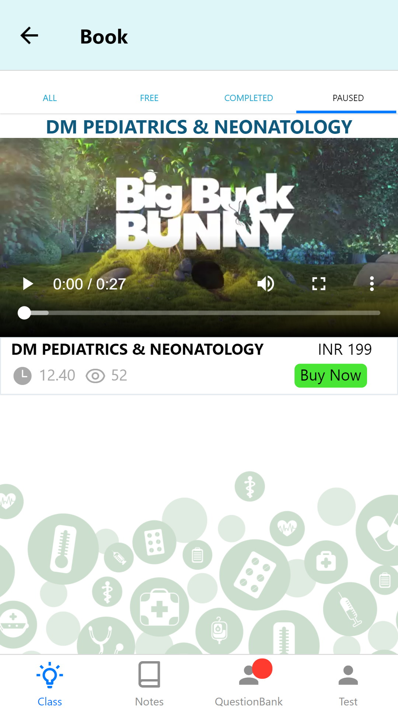
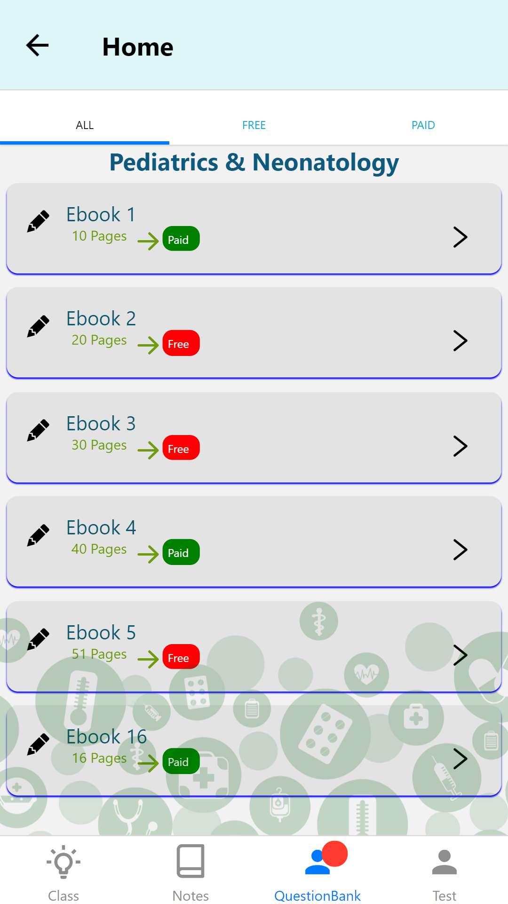
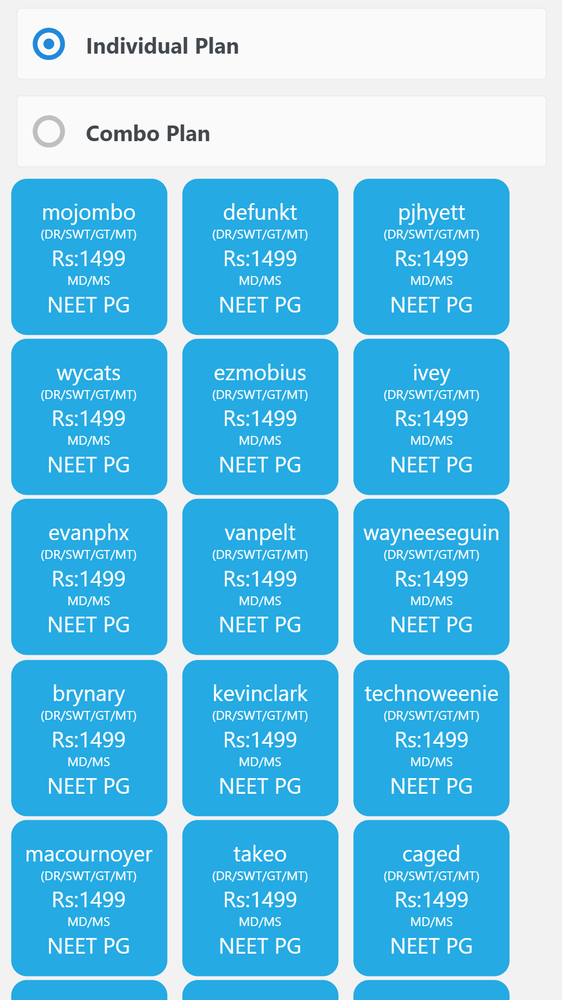

Getting Started
---------------

You can simply clone this repo and install expo before execute this project.

Support
-------

If you've found an error in this sample, please file an issue:
https://github.com/kajal452/atom

Patches are encouraged, and may be submitted by forking this project and
submitting a pull request through GitHub. Please see CONTRIBUTING.md for more details.
